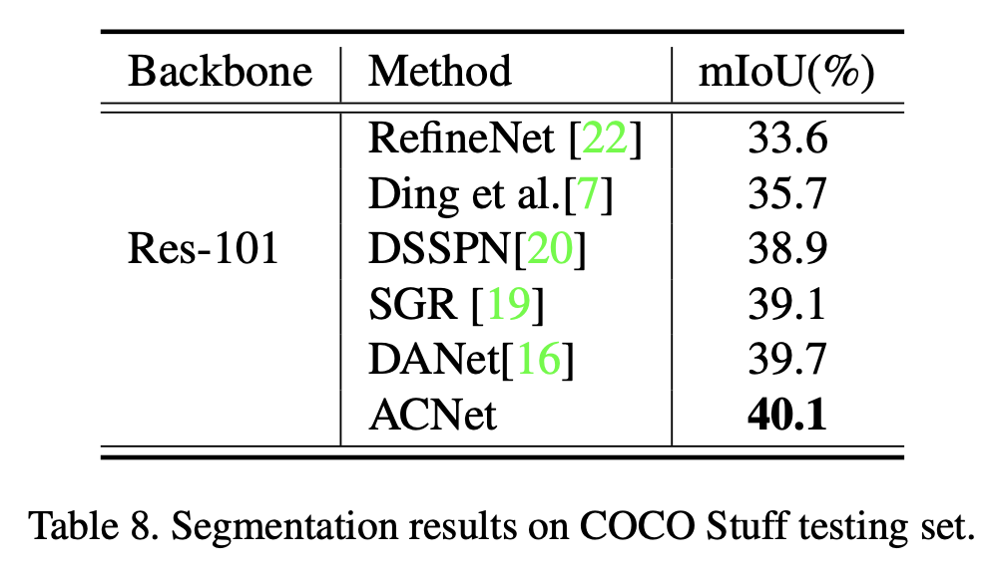

论文名称：《Adaptive Context Network for Scene Parsing》

论文地址：https://arxiv.org/pdf/1911.01664.pdf

本文中发现在每张图片中的上下文需求会因不同像素或者不同区域而不同。基于这个观察，本文提出了一个自适应上下文网络(ACNet),用于捕捉上下文。ACNet将**全局上下文(Global Context)**和**局部上下文(Local Context)**根据不同像素的需求进行融合。特别地，当给定一个像素时，全局上下文的需求通过比较全局特征和局部特征的相似度进行度量，其相反值可以用于度量局部上下文的需求。为了对上下文特征进行度量，本文还提出了全局上下文模块和局部上下文模块，生成自适应的上下文特征，并且还在不同尺度上引入了多个上下文模块，用于获取由粗到细的结果。ACNet在Cityscapes,ADE20K,Pascal Context和COCO stuff达到了sota的效果。网络结构图如下所示。

- ### 本文的主要贡献有四点：

1. 提出了自适应上下文网络(ACNet),用于改进不同上下文的融合。
2. 提出了一种新型的机制用于度量全局上下文需求，全局上下文特征可以被自适应的融合到那些需要较大上下文的像素。
3. 通过局部上下文需求，改进了局部上下文融合，并且渐进地重用局部特征，改进了在小物体和边缘上的分割效果。
4. 在Cityscapes和ADE20K上达到了sota的效果。

- ### 网络整体结构

**ACNet**使用预训练的空洞ResNet作为backbone，并使用多个自适应上下文模块来生成高分辨率的分割图。在网络backbone中，本文将最后一个下采样操作去除，并在最后一个ResNet block中应用空洞卷积，因此可以获得稠密的输出特征，其尺寸为输入图像的1/16。在上采样过程中，三个自适应上下文模块都是用不同的分辨率，每一个自适应上下文模块包括一个全局上下文模块，一个上采样模块和一个局部上下文模块。全局上下文模块从高分辨率的特征中捕捉全局上下文，局部上下文模块从低分辨率低特征中捕捉局部上下文。

- ### 全局上下文模块(GCM)和局部上下文模块(LCM)

- ### 实验结果

