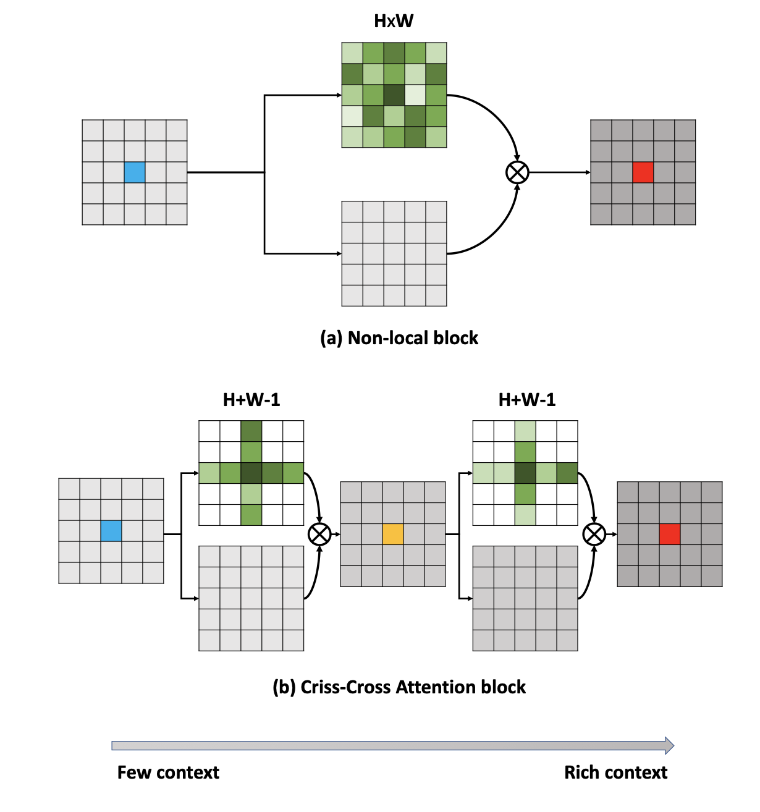
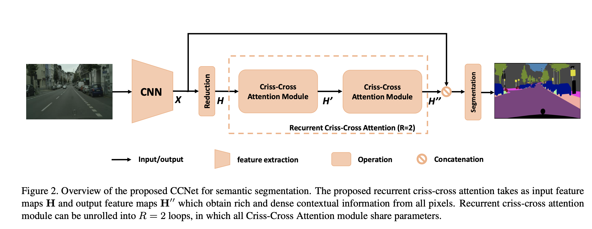
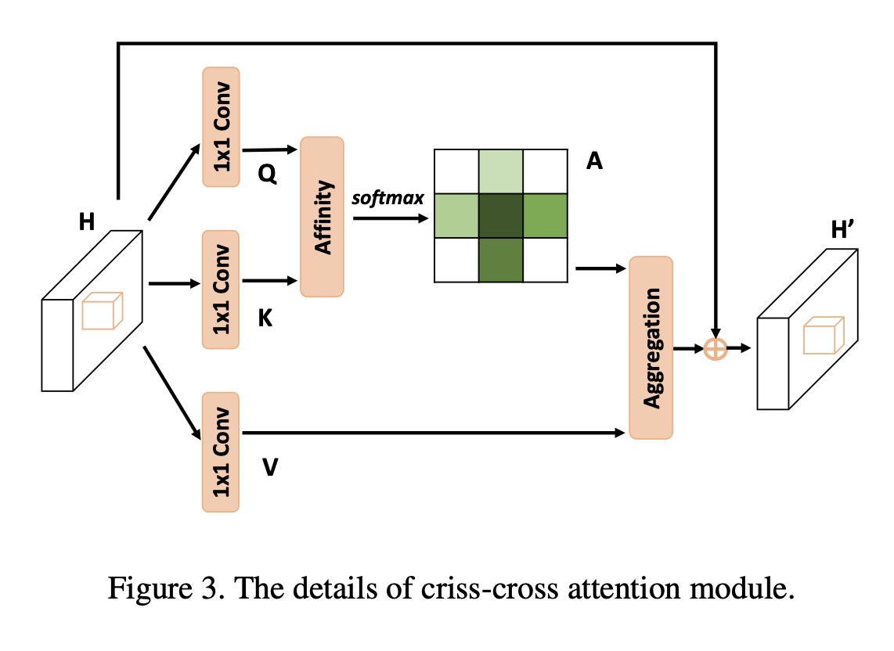
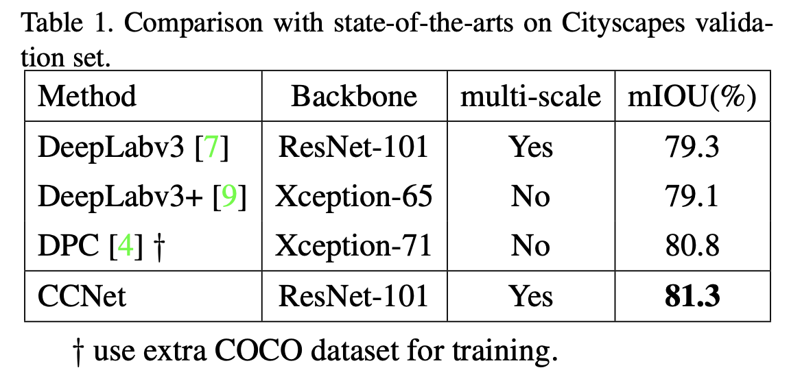
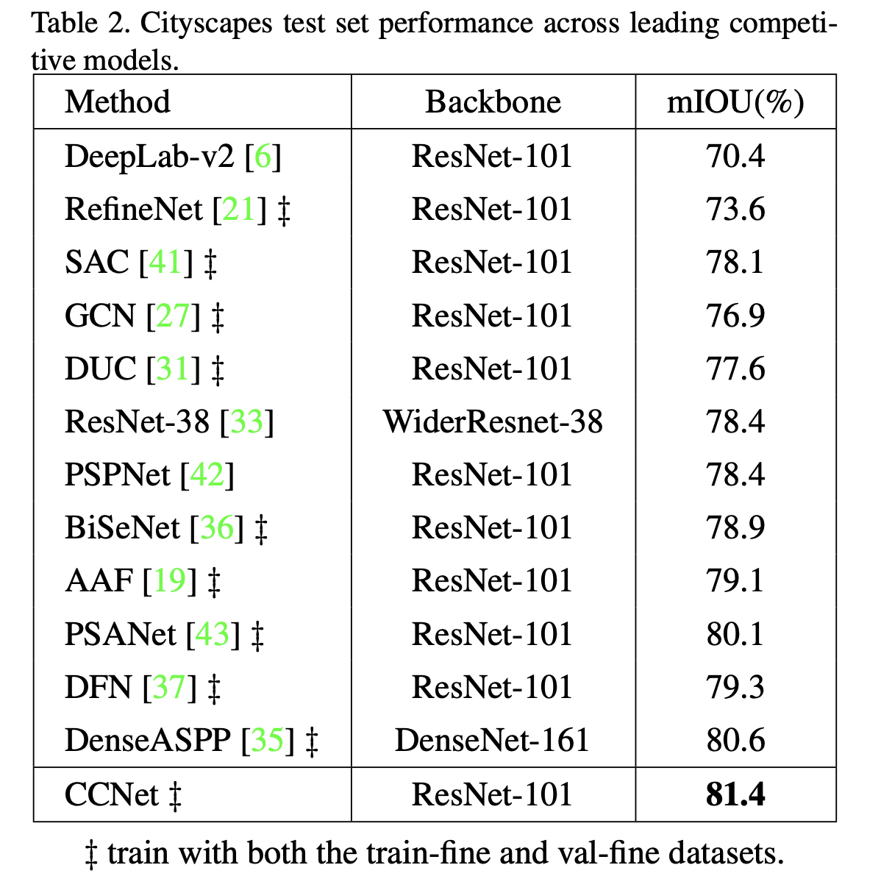
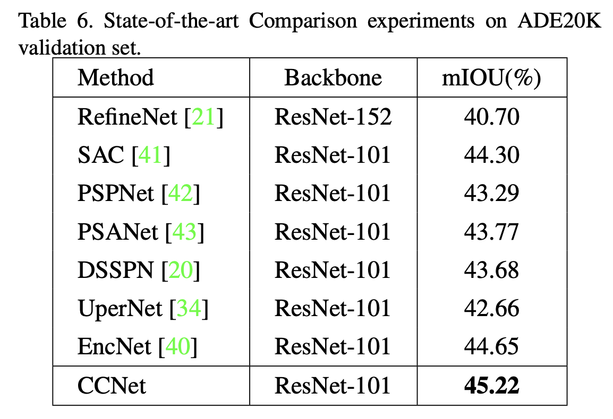

论文名称：CCNet: Criss-Cross Attention for Semantic Segmentation

论文地址：https://arxiv.org/pdf/1811.11721.pdf

源码地址：[https://github.com/speedinghzl/CCNet](https://links.jianshu.com/go?to=https%3A%2F%2Fgithub.com%2Fspeedinghzl%2FCCNet)

远距离的依赖可以捕捉到有用的上下文信息，有利于解决视觉理解问题。本文提出的CCNet旨在更有效和高效地来获取这样的上下文信息。对于每个像素，通过一个新型的十字交叉注意力模块，CCNet可以在一个十字交叉路径上得到它周围像素的上下文信息。通过采取一个循环操作，每个像素可以最终捕捉到所有像素远距离的依赖。总的来说本文提出的CCNet有如下**3点优势**：1）**对GPU内存更友好**，相比于non-local的模块，循环交叉注意力模块仅需要少于其1/11的GPU内存；2）**高计算效率。**在计算远距离的依赖上循环交叉注意力模块相比non-local模块减少了85%的FLOPS。3）**SOTA的性能表现。**交叉注意力模块如下图所示。

- ### 本文的贡献主要有两部分：

1. 提出了新型的**交叉注意力模块**，可以用于更高效地捕捉上下文信息。
2. 基于两个循环交叉注意力模块提出了**CCNet**，在Cityscapes，ADE20K和MSCOCO上达到了SOTA的效果。

- ### 交叉注意力模块(CCA)

- ### 实验结果

