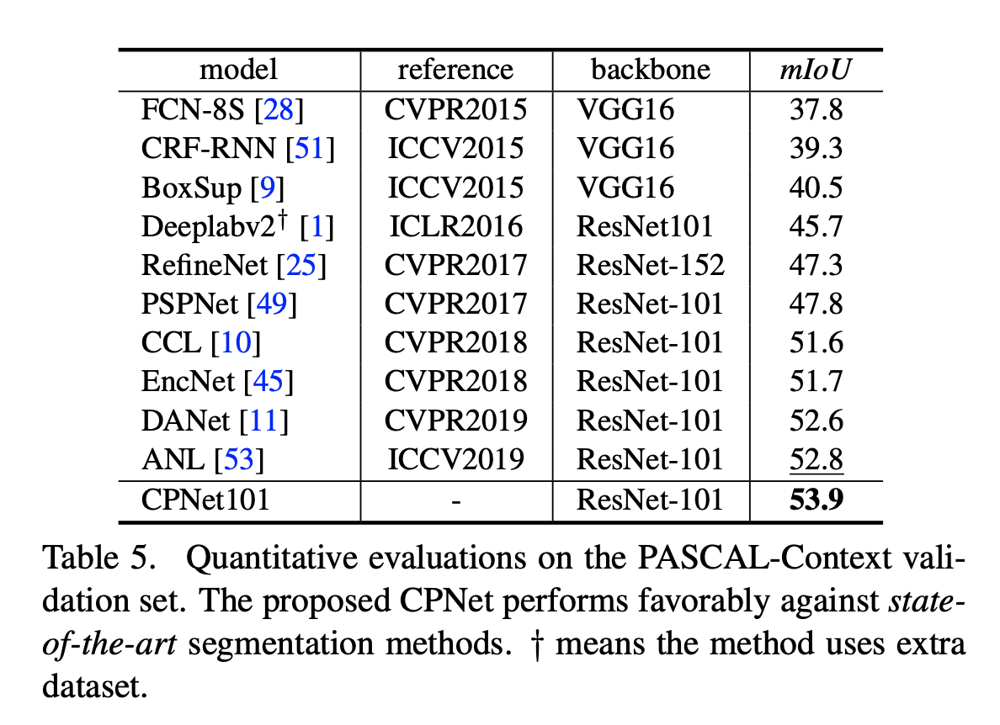

论文名称：《Context Prior for Scene Segmentation》

论文地址：https://arxiv.org/pdf/2004.01547v1.pdf

代码链接：https://git.io/ContextPrior.

最近很多工作都在探索上下文的依赖已达到更好的分割效果。但是很多方法往往没有区分不同类型的上下文依赖，这会导致场景理解的污染。本文通过特征聚合的监督来区分类内和类间的上下文，特别地通过亲和力损失引入了上下文先验的概念，给定输入图片和真值，亲和力损失构建了一个affinity map来监督学习上下文先验。学习到的上下文先验提取出属于同一类的像素，同时相反的先验监督不同类别的像素。特出的上下文先验层嵌入到CNN网络中，可以选择性的捕捉类间和类内的上下文依赖，从而得到更加鲁棒的上下文表达。本文基于上下文先验设计了CPNet，并在cityscapes,ade20k,pascal context上达到了sota。

- #### 本文主要贡献：

  1.通过嵌入在上下文先验层中的亲和力损失构建了上下文先验，显式地捕捉类间和类内上下文依赖。

  2.设计了一个有效的上下文先验网络(CPNet)。

  3.本文提出的CPNet在ADE20K验证集上mIoU达到了46.3%，在Pascal Context验证集上mIoU达到了53.9%，在cityscapes测试集上mIoU达到了81.3%。

- #### 网络结构图

  

- #### 亲和力图（Affinity Map）

  

  在语义分割任务中需要对每一个像素预测一个语义类别。对于网络来说，对一个独立的像素进行上下文的建模是很困难的。为了将网络归一化并对类别之间的关系进行建模，本文提出了亲和力损失。对于每一个单独的像素，这个损失会迫使网络去考虑相同类别的像素和不同类别的像素。给定一个输入的真值，可以知道每个像素的上下文先验，即哪些像素是属于相同类别的，哪些像素不是。因此可以通过真值来引导网络去学习上下文先验。

  亲和力图通过如下损失来进行监督学习

  

  最终的亲和力损失为

  

  其中L_u为BCE损失。

  - #### 总损失函数

    

    三部分损失从左到右分别为分割损失，辅助损失和亲和力损失。

  - #### 实验结果

    

    

    

    

  