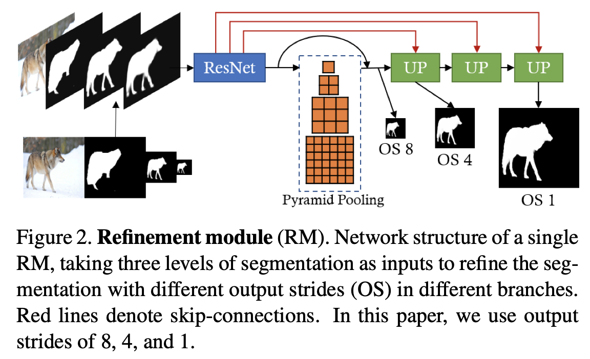
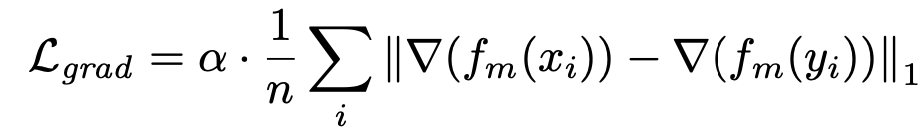
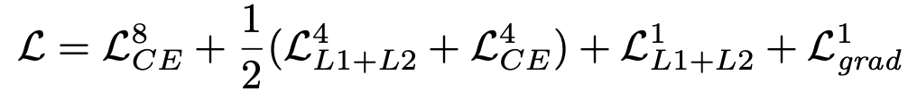
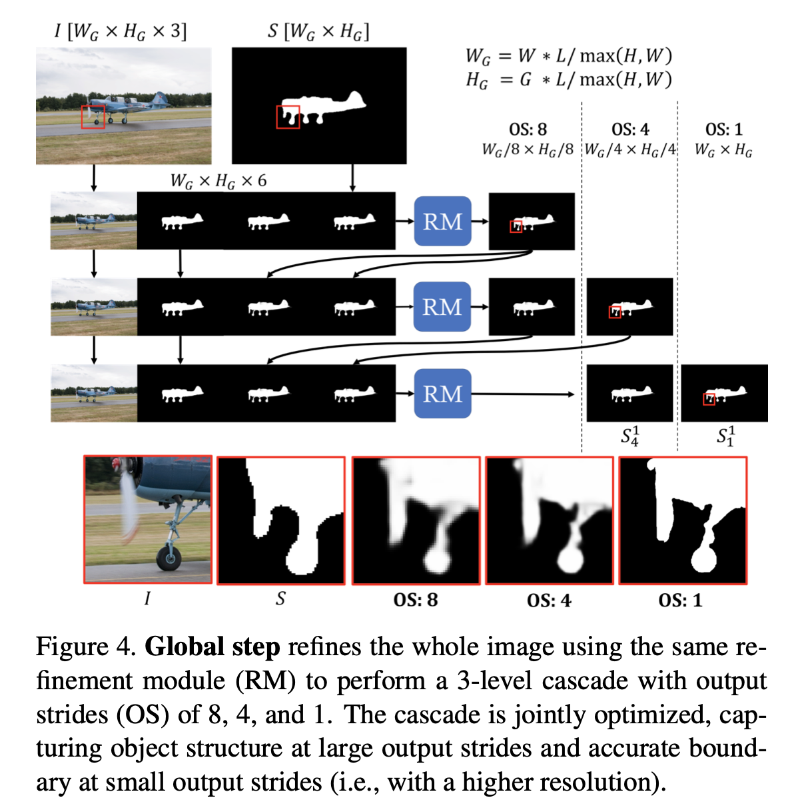
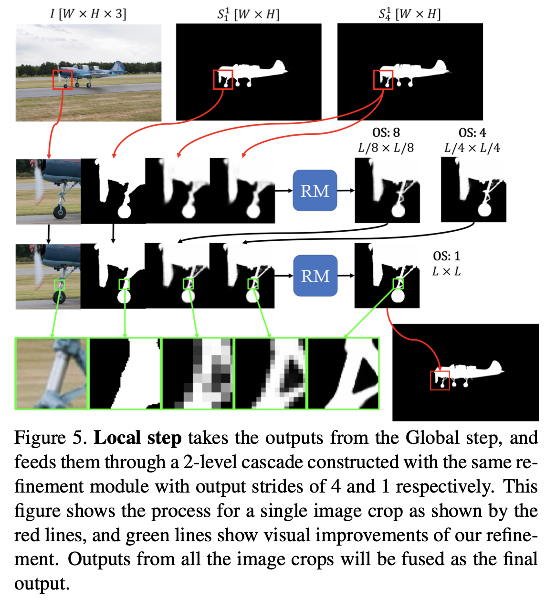
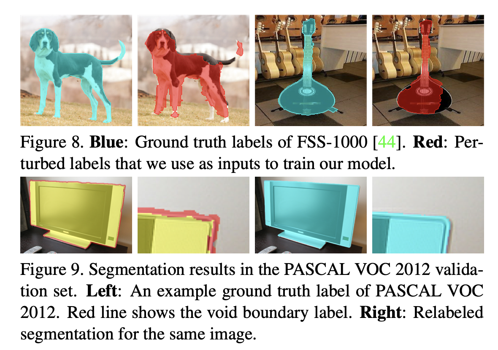
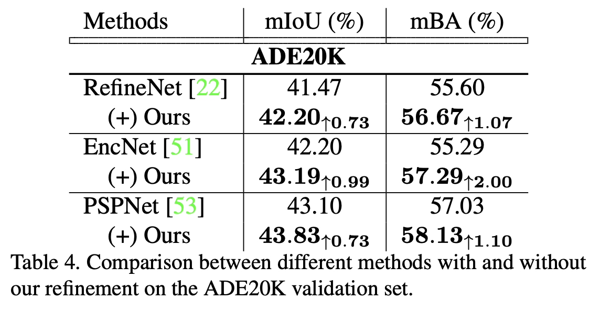
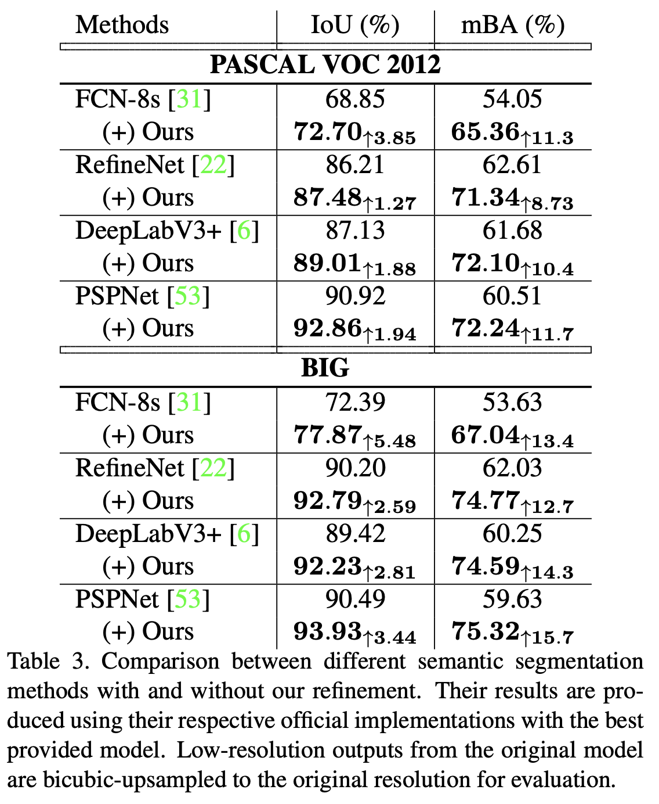

论文名称：《CascadePSP: Toward Class-Agnostic and Very High-Resolution Segmentation via Global and Local Refinement》

论文链接：https://arxiv.org/pdf/2005.02551.pdf

代码链接：https://github.com/hkchengrex/CascadePSP

语义分割中，对于高分辨率的图片分割精度往往不高，这是由于仅使用双线性插值对低分辨率的分割结果进行上采样难以捕捉到高分辨率中的细节边缘信息。本文在不使用高分辨率训练图像的前提下，提出了一个新的方法CascadePSP来解决这个问题。尽管网络在低分辨率的图片上训练，CascadePSP能在4K高分辨率图片上达到很好的分割效果。本文在不同数据集上进行了研究，展示了CascadePSP在不进行finetune的条件下能有效的揭示像素精度的分割边缘，因此可以被认为是类别不可知(class-agnostic)的方法。

- #### 本文主要贡献：

  1.提出了CascadePSP,一个具有泛化性的级联分割细化模型，可以细化任何给定的输入分割图；
  2.可以产生先前分割模型无法产生的高质量、高分辨率的分割结果；
  3.引入了一个高分辨率数据集BIG来评估模型效果；

- #### CascadePSP结构

  - 细化模块（RM）

    

    RM模块的输入是原始图片和多尺度分割图上采样的concat,这使得网络可以自适应的融合不同分割mask的特征以得到更加细化的结果。本文使用PSPNet50作为RM的基础结构得到8倍OS的特征图，特征图上采样特征会和backbone的相应层有跳跃链接，类似于FPN的结构，最后再经过两个1x1的卷积得到网络的输出。

    - 使用的损失函数

      - 对于输出OS=8的分割图，使用标准的CE损失；

      - 对于输出OS=4的分割图，使用L1+L2损失和CE损失的平均值；

      - 对于输出OS=1的分割图，使用L1+L2损失加上边缘梯度损失；

        其中边缘梯度损失可以如下定义

        

        其中f_m(·)是3x3的均值滤波器，∇表示sobel边缘提取算子，n为像素的数量。

    - 总损失函数如下

      

  - 全局和局部级联细化

    - 在测试阶段使用训练时的**RM模块**，经过全局处理和局部处理操作来展现高分辨率的分割细化结果。相同的RM模块在整个过程中可以被循环使用。

    - 全局处理

      - 流程图

        

    - 局部处理

      - 流程图

        

    

- #### 训练过程

  - 为了学习物体的信息，本文通过类别不可知的方式，并使用一些模型的集合来训练模型。本文将MSRA-10K,DUT-OMRON,ECSSD,FSS-1000融合成一个包括36572的数据集，这个大于1000类的数据集能使得模型对于一些新的类别具有更强的鲁棒性。

  - 在训练过程中，对原图进行224x224的随机裁剪，通过对gt进行扰动来生成输入分割图。这个输入会经过global step的三层级联，在每个层级都会进行loss计算。

  - 尽管crop size比测试时使用的L要小，本文提出结构中的全连接特征提取器保证了变换不变性，同时PPM提供了重要的图像上下文信息，使得本文的模型在效果没有明显下降的前提下，能够扩展到更高分辨率的输入上。小的crop size能够使得网络的训练速度加快。

  - 为了保证泛化性，避免对某种模型过拟合，训练时不使用其他现成模型生成的分割图作为输入。作为代替的扰动真值，应该能描绘出不同的形状以及其他模型输出的不精确的分割图。为了达到这个要求，本文通过随机空洞和腐蚀对gt进行采样，来生成扰动分割图。

    

    

- #### 实验结果

  

  

  

