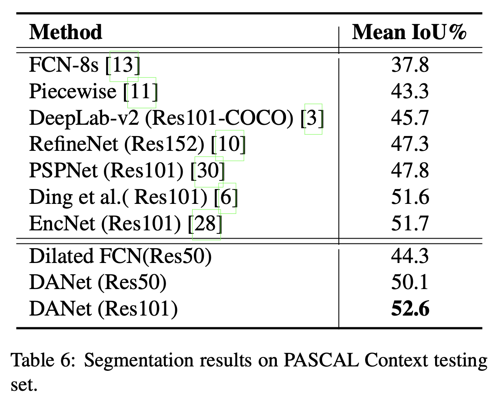

论文名称：Dual Attention Network for Scene Segmentation

论文地址：https://arxiv.org/pdf/1809.02983.pdf

源码链接：https://github.com/junfu1115/DANet

本文通过基于自注意力机制的上下文信息捕捉，来解决场景分割的任务。不像之前的一些基于多尺度的特征融合,文章提出DANet 来自适应地整合局部特征和全局依赖。文章提出了两种注意力模块置于空洞FCN之前，分别对空间中的语义依赖和通道维度的语义依赖进行建模。位置注意力模块(position attention module)通过所有位置特征的加权和实现，有选择的聚合每个位置的特征。通道注意力模块(channel attention module)通过聚合所有通道图的相关特征，选择性的强调相互关联的通道图。

- #### 本文主要贡献：

1. 提出了新型的**对称注意力网络(DANet)**，通过自注意力机制增强了特征表达的分辨能力。
2. 位置注意力模块被提出用于学习特征的空间内在依赖；通道注意力模块用与学习特征的通道内在依赖。
3. 在Cityscapes，Pascal Context，COCO stuff3个比较著名的benchmark上达到了sota效果。

- #### 网络结构图

- #### 对称注意力模块

  

- #### 实验结果

  

  

  

  

  