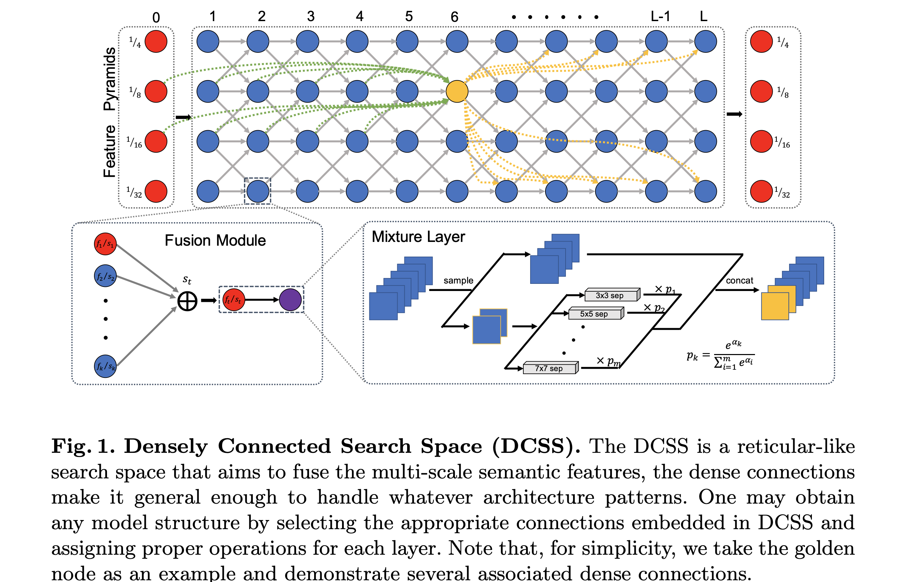
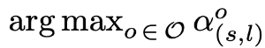
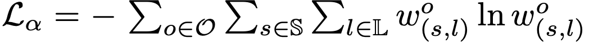

论文名称：《DCNAS: Densely Connected Neural Architecture Search for Semantic Image Segmentation》

论文地址：https://arxiv.org/pdf/2003.11883v1.pdf

神经网络架构搜索（NAS）已经在密集图像预测的自动网络架构设计上展现了很大的潜力，然而现有的NAS算法常在限制的搜索空间上妥协，并在代理任务(proxy task)进行搜索以保证可实现的计算需求。为了保证网络架构尽可能广并避免目标任务和代理任务之间的差距，本文提出了密度连接NAS框架，直接通过目标数据集上多尺度的视觉信息的表达来搜索最优的网络结构。特别地，通过可学习的权重连接细胞，本文提出了密度连接搜索空间来代替大量主流的网络结构设计。此外，通过融合path-level和channel-level的采样策略，本文设计了一个融合模块来减少主要搜索空间上的内存消耗。本文提出的DCNAS在多个公开的数据集如Cityscapes,Pascal VOC2012上都达到了sota的表现。

- #### 本文的主要贡献：

1. 本文设计了首个完整的密度连接的搜索空间，允许探索多种现有的网络设计，并能覆盖随机的模型结构模式。
2. 本文实现了首个proxyless的搜索范式，从编码在DCNAS的模型中搜索到最适合大分割数据集的模型。
3. 在Cityscapes,Pascal VOC2012,Pascal Context和ADE20K数据集上达到了sota效果。

- #### 密度连接搜索空间（DCSS）

   DCSS包括两个原始成分——混合层和融合模块。混合层被定义成一些算子的融合，融合模块的目的是整合之前融合模块中的语义特征。大量网状密度连接的融合模块组成了DCSS的架构。

  

  - **混合层（mixture layer）**

     混合层是由MobilenetV2的不同配置+SE操作组成的算子空间，特别地，卷积核的尺寸可选的有「3，5，7」，扩张率可选的有「3，6」。考虑到DCSS内在支持不同尺度语义特征的融合，扩大了感受野，因此混合层并不在外部支持空洞卷积。

  - **融合模块（fusion module）**

    为了探索DCSS中的不同的路径，本文引入了融合模块来整合之前融合模块和特征金字塔中的信息，并将转换后的语义特征赋给后面的融合模块。融合模块中不仅包含混合层，还包含一个形状对齐层。形状对齐层是一个并行多分支结构，将不同空间尺寸和不同通道数的特征输出形状对齐层转化为目标尺寸。特征被对齐并整合好后再被输出融合层尽行有效的融合。

- #### 搜索过程

  因为上述操作都是可微的，故可以在目标数据集上使用SGD来优化结构参数。本文将训练集分为trainA和trainB，他们分别用于更新卷积层的权重参数w和结构参数。

    优化步骤通过以下两步交替进行：

  - 通过更新卷积参数w;
  - 通过更新结构参数.

  其中损失函数L主要为在mini-batch上计算的交叉熵损失。在实际情况下，本文还引入了一些正则化项：

  1. 因为最终会通过来选择最优的算子，于是引入了熵正则化项来优化结构参数
     
  2. 不显眼的转换往往会影响到聚合操作，最终影响收敛。因此本文引入正则化项来解决这个问题：
     
  3. 为了将与每个融合模块连接的模块的数量限制在1～k，故使用拉格朗日乘子将这个限制进行转换并作为一个正则项：
     

- #### 实验结果

  

  

  

  