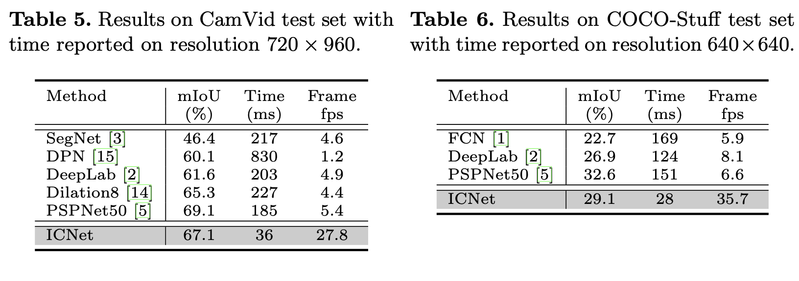

论文名称：《ICNet for Real-Time Semantic Segmentation on High-Resolution Images》

论文地址：https://arxiv.org/pdf/1704.08545.pdf

代码链接：https://github.com/hszhao/ICNet

本文专注于实时语义分割任务，在尽可能快的速度达到较好的精度。

- #### 本文的主要贡献：

1. 提出了一种新型且独特的图像级联网络(ICNet)用于实时语义分割，它有效的利用了低分辨率下的语义信息和高分辨率下的细节信息。
2. 级联特征融合单元和级联标签引导可以在低计算代价的前提下逐渐恢复和细化分割结果。
3. ICNet提高了5倍的推理速度，并且消耗的内存减少了5倍，能在1024x2048点分辨率下达到30fps。

- #### 不同分割网络的比较图

  

  

  - #### 网络结构图

    

    ICNet 将输入图片分别经过2倍和4倍的下采样同时输入网络，下采样1/4的图片先由网络最上方的低分辨率分支(PSPNet50)输入网络，这个分支输出1/32分辨率的分割图，它已经捕获了大部分的语义信息，但是在存在细节丢失和边界模糊；于是可以在中间和底下的中等分辨率和高分辨率分支限制参数的数量，在中等分辨率和高分辨率的分支采用了Light-weighted CNNs，得到的特征图分辨率分别为1/16和1/8。不同尺寸的特征图通过CFF模块融合后输出入下一分支。

  - #### 级联特征融合（CFF）

    

    为了融合不同分辨率输入得到的级联特征，本文提出了一种级联融合特征单元（CFF）。该单元的输入包括三部分：两个特征图F1和F2，其尺寸分别是C1xH1xW1和C2xH2xW2，以及一个真值标签，其分辨率为1xH2xW2，其中F2的空间尺寸是F1的两倍。首先对F1使用双线性差值进行2倍上采样得到和F2一样的空间尺寸，然后使用3x3的卷积核对上采样后的特征进行空洞率为2的空洞卷积得到C3xH2xW2的特征图，这里相比其反卷积，双线性差值+空洞卷积可以使用更少的参数获得同样的感受野。对于特征F2，使用1x1卷积将其通道数由C2映射到C3，尺寸不变。这两部分处理过后的特征会经过BN层归一化，再进行逐像素的加和以及relu得到融合特征F2'。为了增强对F1特征的学习，还对F1上采样后的特征进行辅助标签引导。

  - #### 级联标签引导

    为了增强在每个分支的学习过程，本文采用了级联标签引导策略，利用不同尺度下的真值标签来引导不同分辨率分支的学习。

    

  - #### 实验结果

    

    

    