论文名称：CVPR2018 The Lova ́sz-Softmax loss: A tractable surrogate for the optimization of the intersection-over-union measure in neural networks

论文链接：https://arxiv.org/pdf/1705.08790.pdf

由于其感知质量和尺度不变性， 相比于逐项素的损失对小物体相关性更合适，也更能正确对计算结果中的False Positive,故Jacard系数即IoU经常被用于图像分割结果的评估中。文章提出了语义分割mIoU直接优化的方法，基于凸的Lova ́sz extension的子模损失函数，这个关于Jaccard系数的损失函数相比于传统的交叉熵损失函数有更好的表现。文章还展示了按每张图片优化Jaccard系数和在整个数据集上优化Jaccard系数定量和定性的差别。最后文章基于Deeplabv2的pipeline 在PASCAL VOC 和Cityscapes两个数据集上进行了对比实验。

- #### **子模损失函数的优化替代**

  对于分割结果`y*`和`y ̃`，如下定义第c类的预测错误的像素集合：
  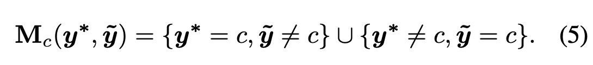

  对于一个固定的真值`y*`，Jaccard损失函数可以被表示成{0,1}^p →R的映射：
  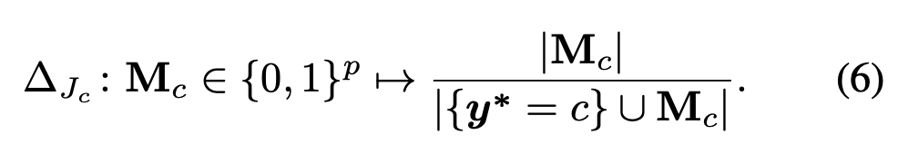
  但是这里Mc是一个离散化的0-1向量，作者想要这个损失函数能应用于任意的实数向量m ∈ R^p+,但是要计算一个集合函数的凸闭式函数是一个NP-hard问题，幸运的是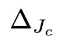是一个子模函数，子模函数定义如下：

  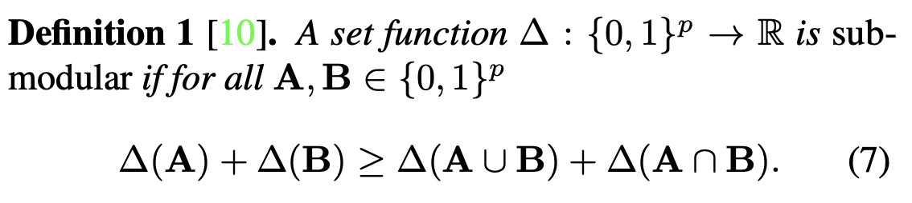

  子模函数的凸闭式解是紧的并且可在多项式时间内计算得到，他的解就是一个Lova ́sz延拓，其定义如下：

  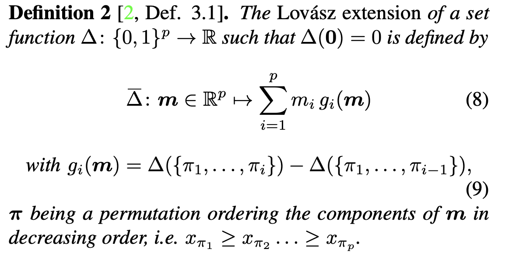

- ### 代替函数对于二分类和多分类任务有两种不同的形式

  - 二分类任务使用**Lovasz hinge**损失函数

    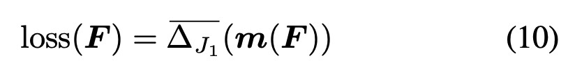

  - 多分类任务使用**Lovasz softmax**损失函数

    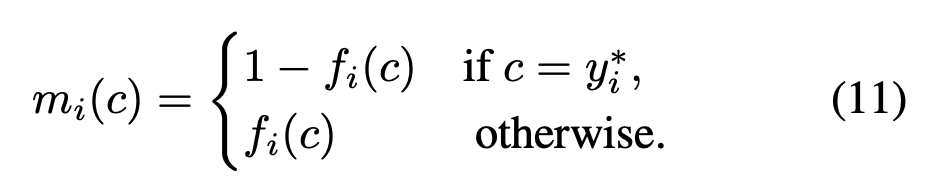

  - Jaccard系数的Lovasz延拓的导数计算方式如下：

    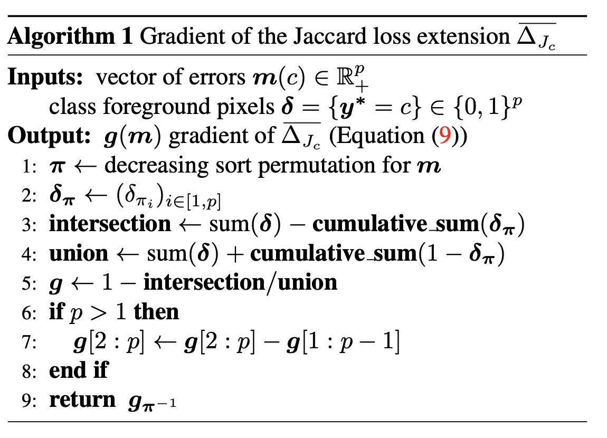

- #### 实验结果

  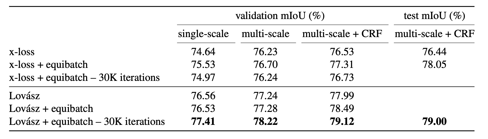

  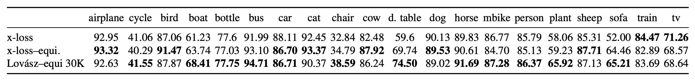

  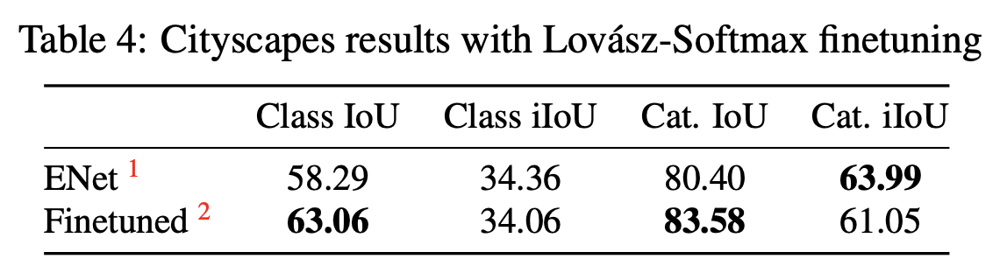

  