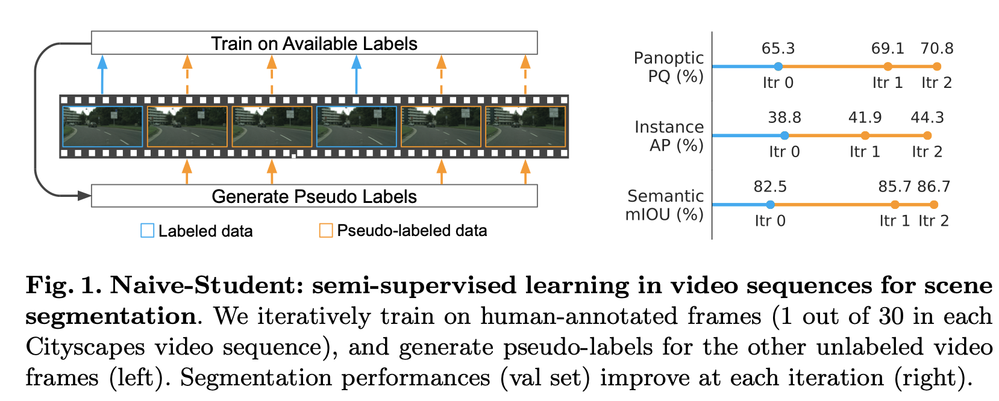
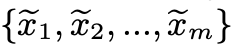
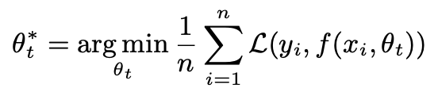
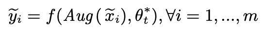
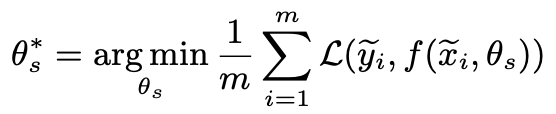
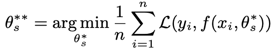
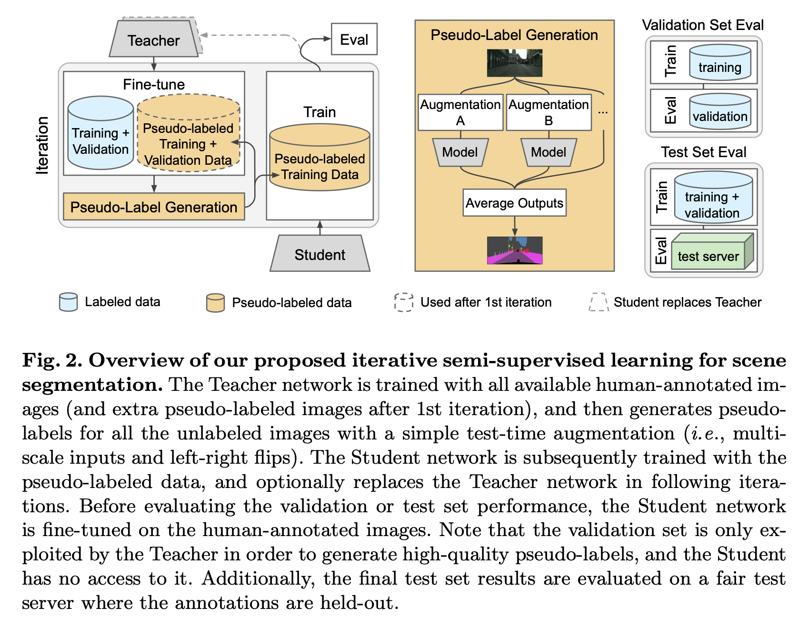
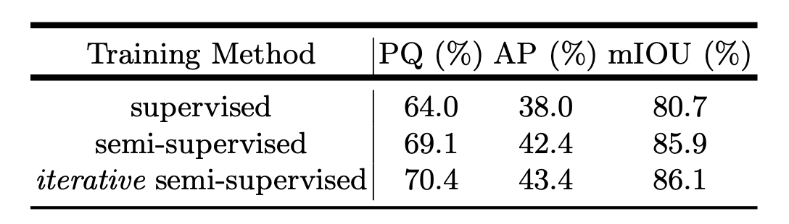
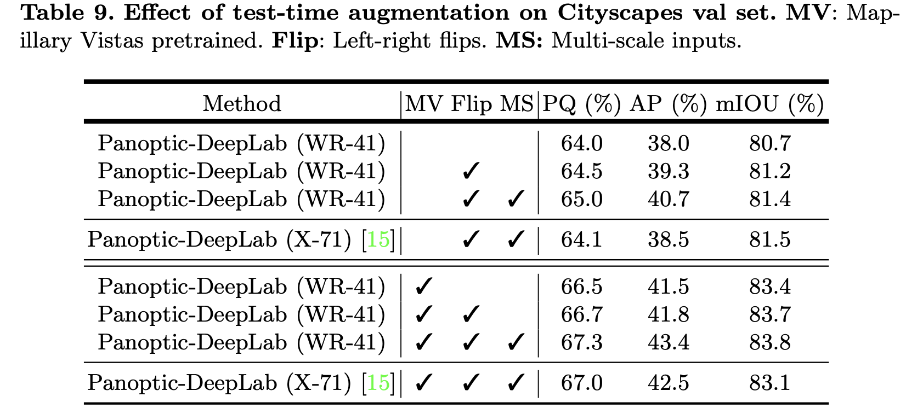
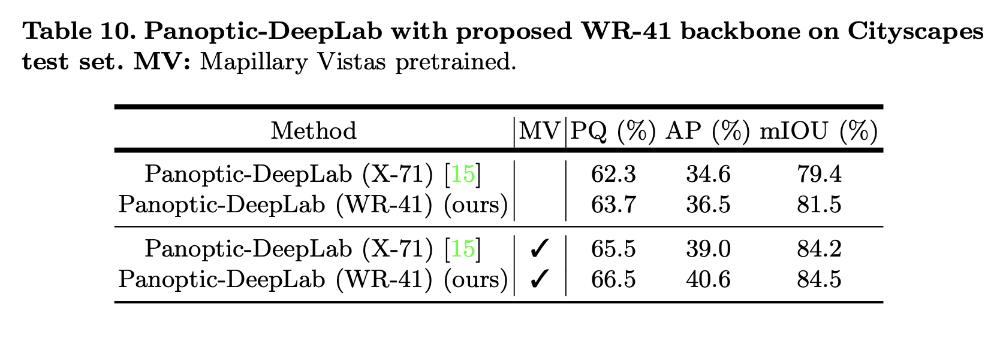

论文名称：《Leveraging Semi-Supervised Learning in Video Sequences for Urban Scene Segmentation》

论文地址：https://arxiv.org/abs/2005.10266

在CV领域监督学习的效果往往和标注数据集的大小息息相关，这一特性在分割任务重尤为明显。然而实际中人工标注的成本很大，并由大量未标注的数据存在。本文将**半监督学习**应用在未标注的街景分割数据集中,工作的目标是为了避免构建复杂的，已学习的专用与标签传播的结构，仅仅简单的预测未标注数据，并通过标注数据和伪标注数据来训练序列模型，并将这个过程进行多次迭代。文章提出的这个Naive-Student模型在cityscapes test集合上达到了 **85.2%** mIoU.

- ### 算法流程

  \- 输入：

  1. 标注数据，n对图片x_i和对应的人工标注y_i；
  2. 未标注数据

  - step1: 通过最小化损失，用人工标注数据训练一个教师网络θt；

    

  - step2: 使用TTA对未标注图片生成伪标签；

    

  - step3: 使用相同的损失函数在未标注数据下训练一个同样或者更大的学生网络θs；

    ​                                          

  - step4: 使用手动标注数据fine-tune上一步得到的学生网络θs*；

    

  - step5: 返回第2步并将学生网络θs**作为教师网络来进行迭代；

- ### 网络结构及训练流程图

- ### 实验结果

