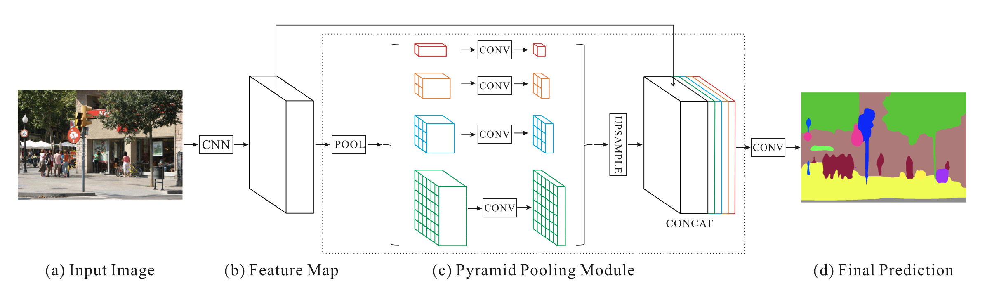
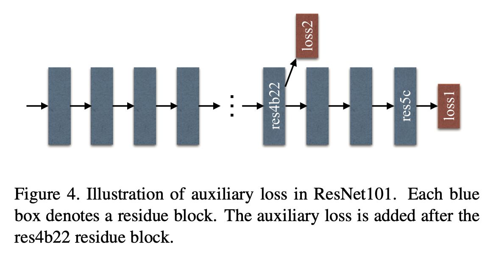
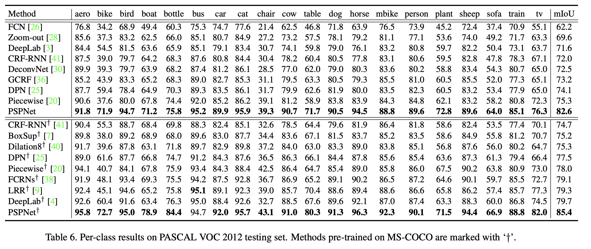
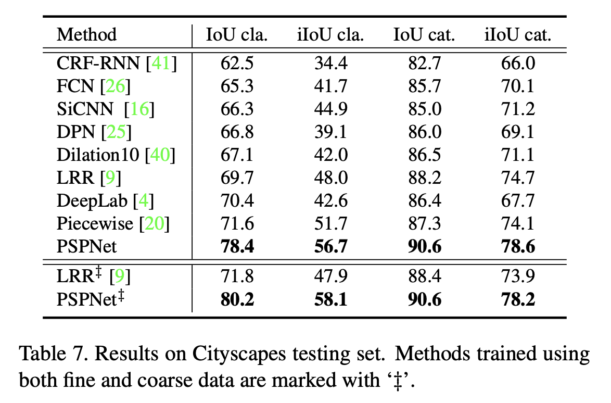
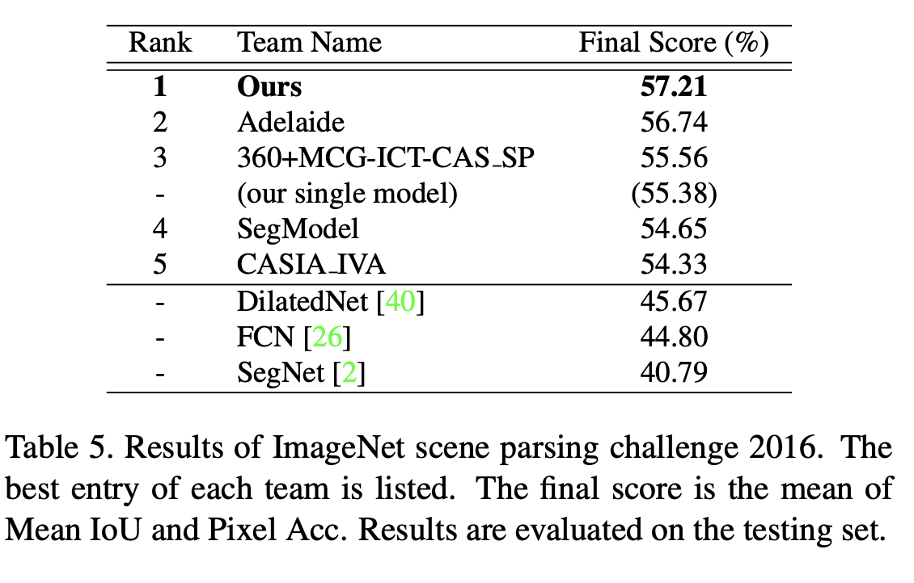

论文名称：《Pyramid Scene Parsing Network》CVPR2017

论文地址：https://arxiv.org/pdf/1612.01105.pdf

官方源码：https://github.com/hszhao/PSPNet

本文探索了通过金字塔池化模块和PSPNet网络聚合不同区域上下文，从而得到的全局上下文信息的能力。本文提出的全局表达对于在场景解析任务中能产生很好的结果，此外PSPNet还为像素级别的预测提供了一个监督框架。本文在ImageNet scene parsing challenge 2016, Pascal VOC2012，cityscapes上都达到了sota的效果。

- #### 本文主要贡献：

1. 提出了金字塔场景解析网络（PSPNet），将不同场景的上下文特征嵌入到了基于FCN的网络框架中。
2. 基于深度监督损失，提出了针对深层ResNet的有效优化策略。
3. 搭建了一个针对场景解析和语义分割的实用系统。

- #### PSPNet

  - **网络结构**

    

  - **重要的发现**
    在ADE20K数据集中包括150种语义类别的标注，本文总结了一些在baseline中对与复杂场景解析存在的问题：
        1、上下文关系不匹配。例如将河里的船预测成车。
        2、类别混淆。在ADE20K中有些类别容易混淆，例如建筑和摩天大楼，地面和田地等，在baseline有会出现在同一个物体上预测出两种或多种相近类别。
        3、不显眼的类别。例如将床上的枕头和被单混为一体。

  - **金字塔池化模块**
    金字塔池化模块融合了4中不同尺度下的特征。当特征图进入金字塔池化模块后，先会被划分成不同尺寸的区域，比如1x1,2x2,3x3,6x6，然后对在特征图的每一个小区域内进行池化操作，从而得到不同4种尺寸的全局特征。为了维持全局特征的权重，在每一个尺寸的全局特征后加上一个1x1卷积，将全局特征的通道数进行压缩，压缩至原特征图1/N，N代表金字塔的层级数，比如上图N=4。最后不同尺度的特征图通过双线性插值上采样恢复到相同尺寸，再与输入金字塔模块的特征进行拼接，得到金字塔模块输出的特征图。

  - **网络结构**
    PSPNet使用ResNet+空洞网络策略作为backbone，用于提取原始图片的特征图。特征图的尺寸是输入图片尺寸的1/8。然后将特征图输入金字塔池化模块，整合不同尺度的上下文信息。将金字塔池化模块不同尺度的特征上采样后与输入特征进行拼接，再经过一次卷积即得到最终预测的分割图。

  - **对于基于ResNet FCN的深度监督**
    在中间层加入一个辅助损失，并与最后一个输出得到的损失共同进行反向传播，这个辅助损失有助于学习过程的优化。在测试阶段将忽略这个辅助分支。

    

  - #### 实验结果

    

    

    

    