论文名称：《Region Mutual Information Loss for Semantic Segmentation》

论文地址：https://arxiv.org/pdf/1910.12037.pdf

源码链接：https://github.com/ZJULearning/RMI

- #### 提出方法动机
  语义分割是一个逐像素分类的任务，大部分的分割模型使用的是逐像素的CE损失，但是逐像素的损失忽略了一张图片中像素之间的关联。基于这个想法，本文提出了区域交互信息(RMI)损失，能够更简单有效的对像素之间的关系进行建模。

- #### 方法概述
  RMI使用当前像素和它的邻居像素来表示当前像素，对于图像中的每一个像素都可以得到一个多维度的点来对像素关系进行编码，同时整张图片可以看成是这些高维点的多维度分布。通过最大化交互信息(MI),预测和真值就可以达到一个较高的有序一致性。

  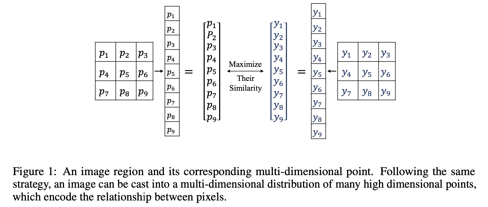

- #### 背景知识

  一个离散随机变量的熵可以如下定义,它是一个随机变量不确定性的度量。

  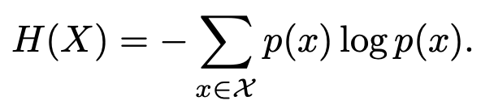

  联合熵和条件熵定义如下：

  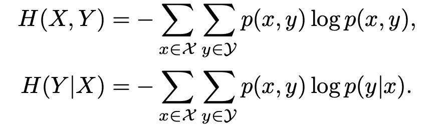

  二者之间的关系如下：

  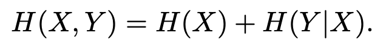

  由此引出了交互信息的定义，它度量的是两个随机变量之间相互包含的信息量：

  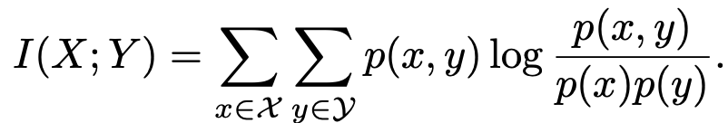

  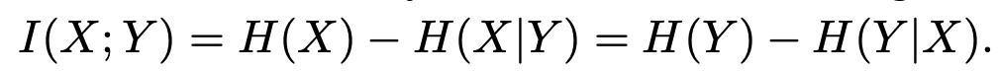

- #### 具体实现方法
  如图一所示，有两个多元随机变量P和Y，前者是预测的概率，后者是真值，那么预测和真值的交互信息函数就可以如下定义：

  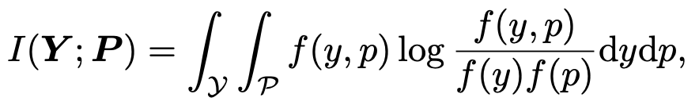

  

  最终模型的目标是要最大化这个交互信息函数，以达到预测和真值的高度有序一致性。想要求解这个交互函数，一个最直接的方式就是找到上述几个PDF，但是图像中的像素都是独立的，这就使得很难去分析它们的联合概率分布f(p)。本文表明，Y和P在图片尺寸R>=30时才满足正态分布，这会消耗很大的内存，是不实际的。基于这个原因，本文选取了交互信息函数I(X,Y)的一个下界，去最大化这个下界从而去最大化交互信息函数的实际值。
  求解这个下界的原理还不是很理解，文中给出最终要优化的下界函数如下所示：

  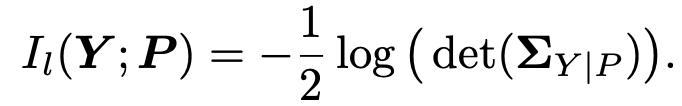

  其中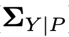是Y的后验协方差矩阵，是一个对称半正定矩阵。

  - 如何对后验协方差矩阵进行估计？

    由于不知道Y和P的概率密度函数或者它们之间的依赖关系，无法得到准确的。文中通过一系列数学假设，最终得到了一个估计式：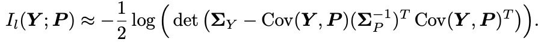,并令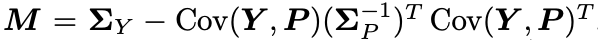

    

  - 实现细节

    - **下采样** 文中选用每个点3x3的邻域来表示每个点多维度分布，一个浮点型特征张量的尺寸为[16,513,513,21]需要占用的原始内存为0.33G，则RMI计算的内存消耗为9x0.33=2.97G,这个消耗量是巨大的，故需要对预测张量和真值进行下采样。

    - **正则化** 由于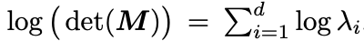的计算值和M特征值的数量有关，故需要对对交互函数除以d达到正则化的效果。

      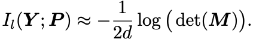

    - **下溢问题** 使用softmax和sigmoid计算得到的数据量级可能会很小，以至于在计算协方差矩阵的时候会发生下溢的情况，基于这个考虑，将上面的交互函数的计算方式又做了进一步改进

      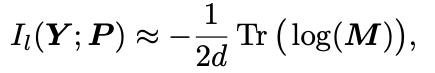

      其中Tr(·)表示矩阵的迹，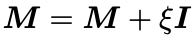

  - 完整损失函数形式

    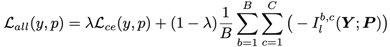

    其中L_ce表示传统的CE损失函数，B表示batchsize,C表示类别数量。整个损失函数可以看成是像素相似度和结构相似度两部分共同构成的损失。

- #### 实验结果

  RMI和其他的一些损失函数和后处理的效果对比

  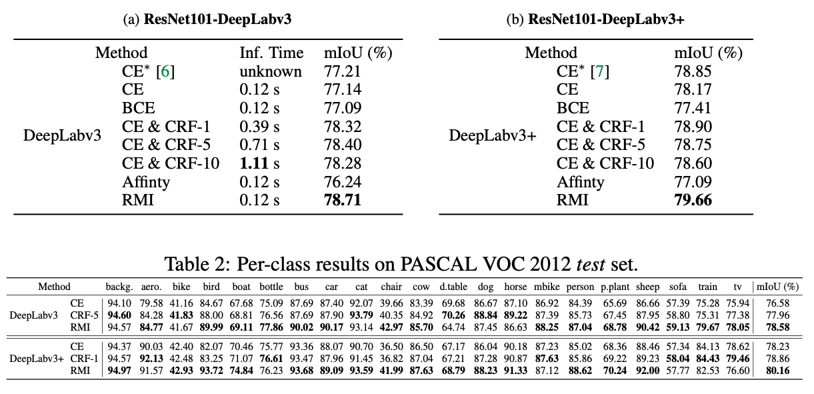

  