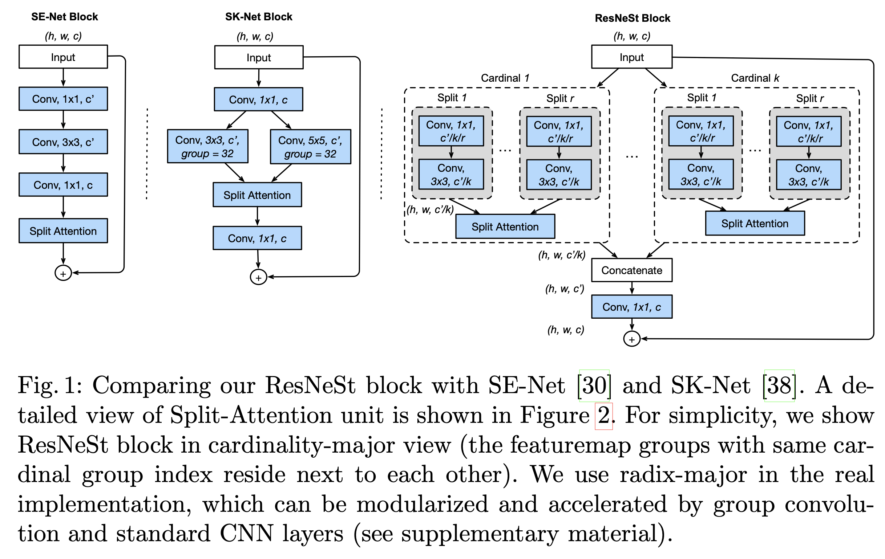
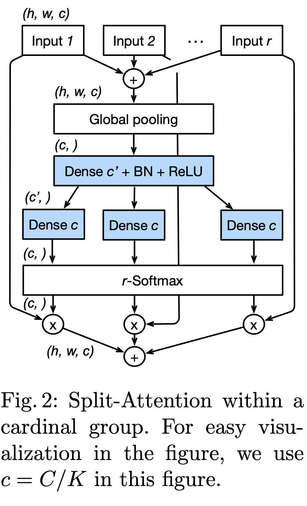
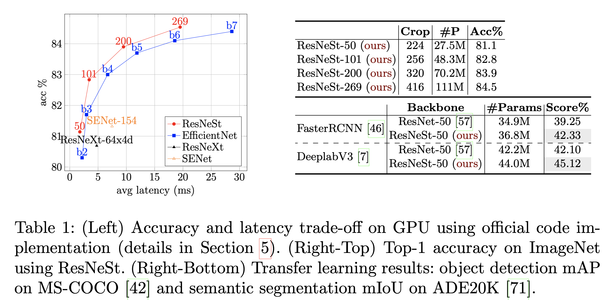
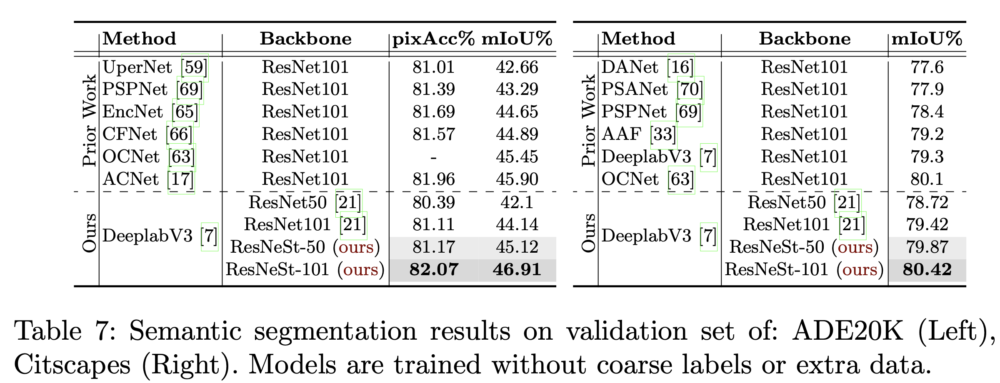

论文名称：《ResNeSt: Split-Attention Networks》

论文链接：https://hangzhang.org/files/resnest.pdf

代码地址：https://github.com/zhanghang1989/ResNeSt

由于图像分类模型的不断发展，很多下游应用，例如目标检测和语义分割，都会因为ResNet的简易性和模块化而使用它的变体。本文提出了一种模块化的划分注意力模块，使得注意力可以穿插在特征图中。通过将这些划分注意力模块进行堆叠，就可得到一种新的ResNet的变体ResNeSt。本文提出的网络保护了所有在下游任务中使用的ResNet结构，并且**不引入额外的计算消耗**。特别地，在语义分割上，ResNeSt将DeeplabV3在ADE20K上的效果由42.1%提升到了45.1%。

- #### 划分注意力模块（Split-Attention）

  

  

  

  - #### 实验结果

    

    

    