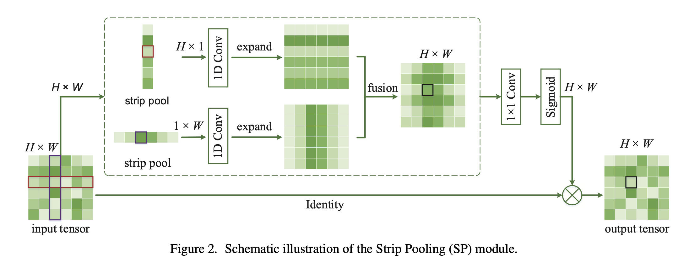
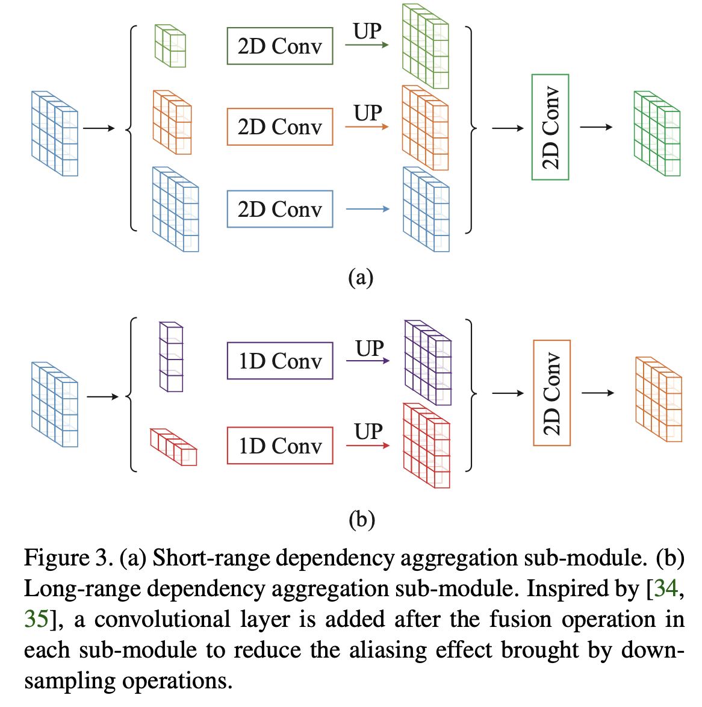
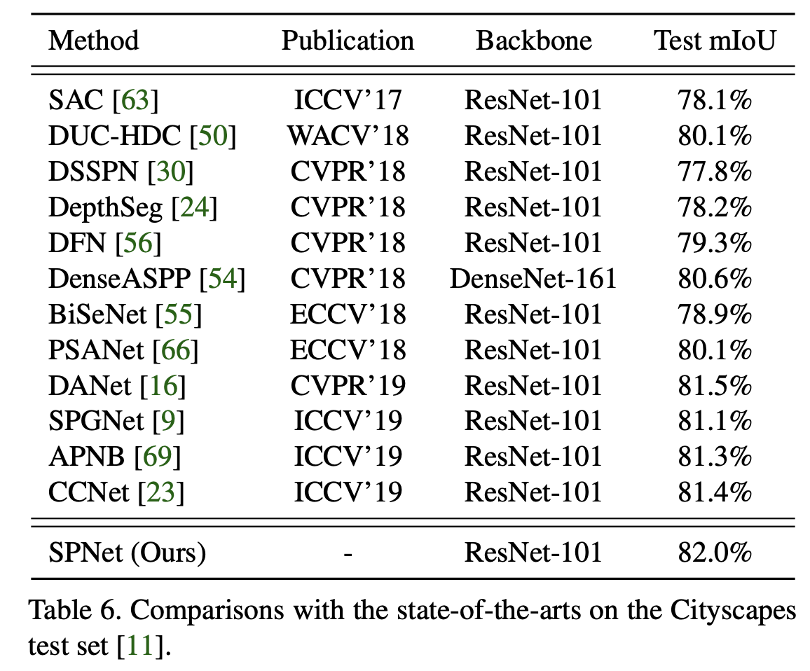
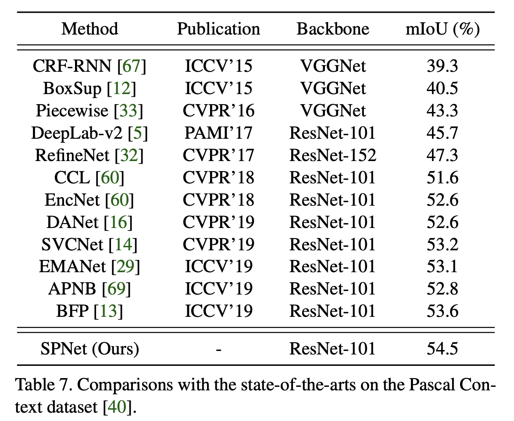
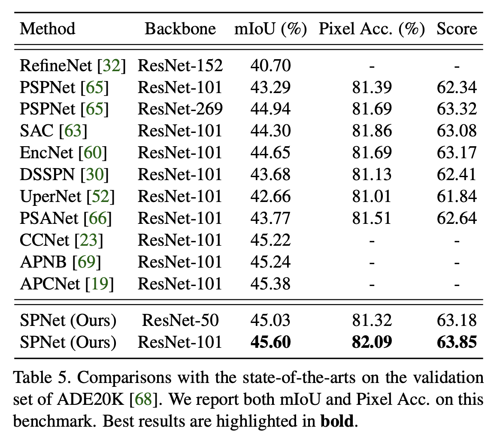

论文名称：《Strip Pooling: Rethinking Spatial Pooling for Scene Parsing》

论文地址：https://arxiv.org/pdf/2003.13328v1.pdf

代码链接：https://github.com/Andrew-Qibin/SPNet.

从之前语义分割的事实表明，空间池化可以有效捕获密集像素预测任务重的长距离上下文信息。本文对传统的NxN正方形空间池化方式进行了重新思考，提出了新的（1xN或Nx1）的条纹池化。

- #### 本文主要贡献：

1. 提出了新的条纹池化的概念，在继承传统卷积能获取远距离上下文信息的优点的同时，还能专注于局部的细节；
2. 基于条纹池化，提出了条纹池化模块(SPM)和混合池化模块(MPM)；
3. 设计了SPNet，将提出的SPM和MPM整合到单个网络中，在ADE20K和cityscapes上达到了sota。

- #### 背景

  提高卷积神经网络中远程依赖关系建模能力的一种方法是采用self-attention机制或non-local模块。然而，它们会消耗大量内存。对于non-local注意力模块消耗内存较大的问题，在CCNet中提出了改进方案。其他的远程上下文建模方法包括:

  - **空洞卷积，其目的是在不引入额外参数的情况下扩大卷积神经网络的感受野;**

  - **全局/金字塔池化，通过结合不同池化核大小的池化层，为图像提供全局信息。**

  ​    然而，空洞卷积和池化操作都是**在正方形卷积中输入特征图并进行卷积运算**。这**限制了它们在捕获广泛存在于现实场景中的各向异性的上下文上的灵活性**。例如，在某些情况下，目标对象可能具有**长条形结构(如图1b中的草地)或离散分布(如图1a中的柱子)**。使用大的方形池窗口不能很好地解决这个问题，因为它将不可避免地合并来自无关区域的污染信息。为了更有效地捕获长依赖关系，本文在空间池化层扩大卷积神经网络感受野和捕获上下文信息的基础上，提出了条形池化（strip pooling）的概念。

  作为全局池化的替代方案，条纹池化有两个优点：

  - 它**沿着一个空间维度部署一个长条状的池化核形状**，因此能够捕获**孤立区域的长距离关系**，如图1(a)和1(c)的第一行所示部分所示。

  - 在**其他空间维度上保持较窄的内核形状，便于捕获局部上下文，防止不相关区域干扰标签预测。**

  在网络中使用这种长而窄的池内核，可以使语义分割网络能够**同时聚合全局和局部上下文信息**。这是与传统的从固定的正方形区域收集上下文的池化有本质的不同。

- #### 条形池化模块（SPM）

  

- #### 混合池化模块（MPM）

  

  - #### 实验结果

    

    

    

    

