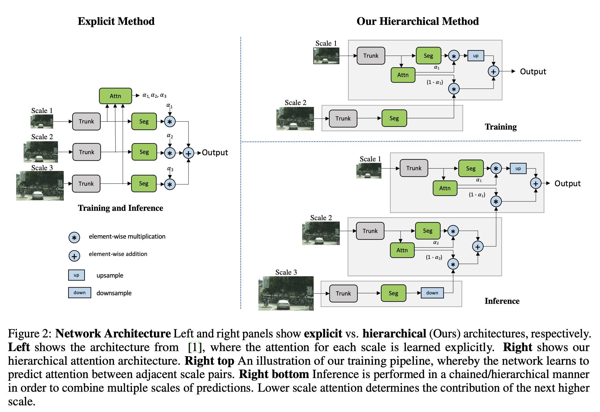
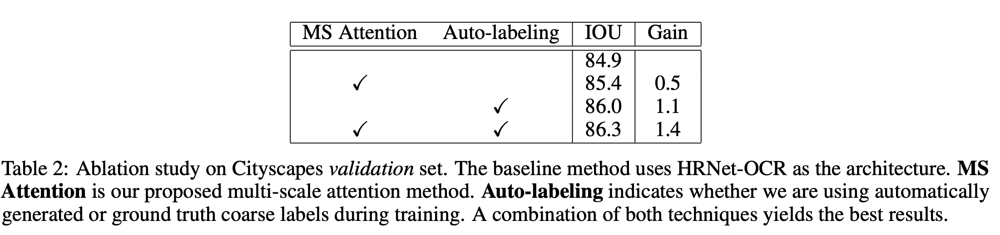
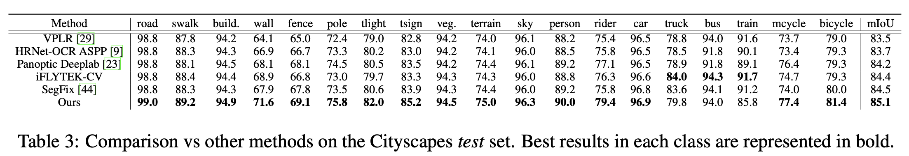
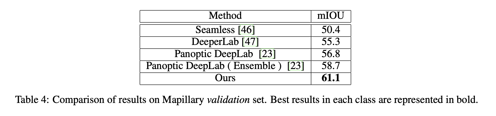

论文名称：《HIERARCHICAL MULTI-SCALE ATTENTION FOR SEMANTIC SEGMENTATION》

论文地址：https://arxiv.org/pdf/2005.10821.pdf

语义分割中常用多尺度推理来改进分割结果。多种尺度的图片传入网络，其融合结果通过平均或者最大池化得到。本文提出了一种基于注意力的方法来融合不同尺度的预测结果。在特定尺度的预测能更好的解决一些失败的模式，为了生成更好的预测结果，网络可以学习去根据不同的情况选择这些尺度。本文提出的注意力机制分层级的，使其可以节约4倍的显存来训练所提出的方法。为了能够更快速的训练，本文提出的方法允许在更大的crop_size下训练从而获得更好的模型精度。本文在Mapillary val上达到(61.1% mIOU)，在Cityscapes test上达到了 85.1% mIOU。

- ### 本文主要贡献：

1. 提出了一个有效的分层级的多尺度的注意力机制，使得网络得以学习如何从多尺度推理得到最好的预测结果；
2. 提出了一种基于硬阈值的利用未标注图片的自动标注策略；
3. 在Cityscapes和Mapillary Vistas数据集上达到了sota；

- ### 网络结构

- ### 实验结果

