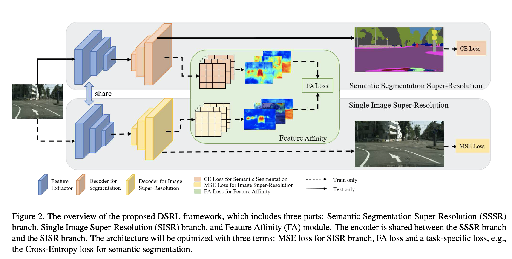
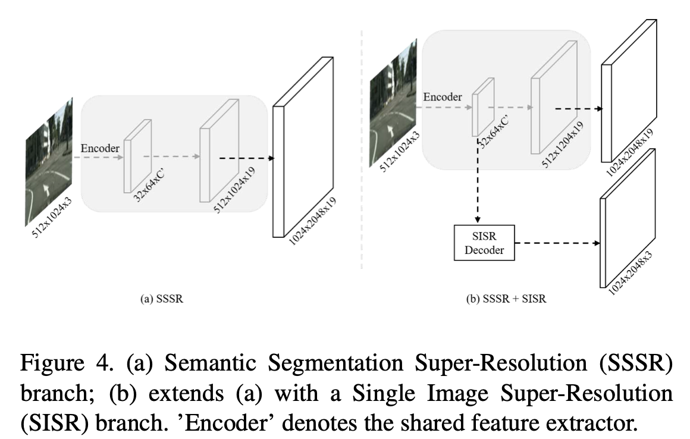
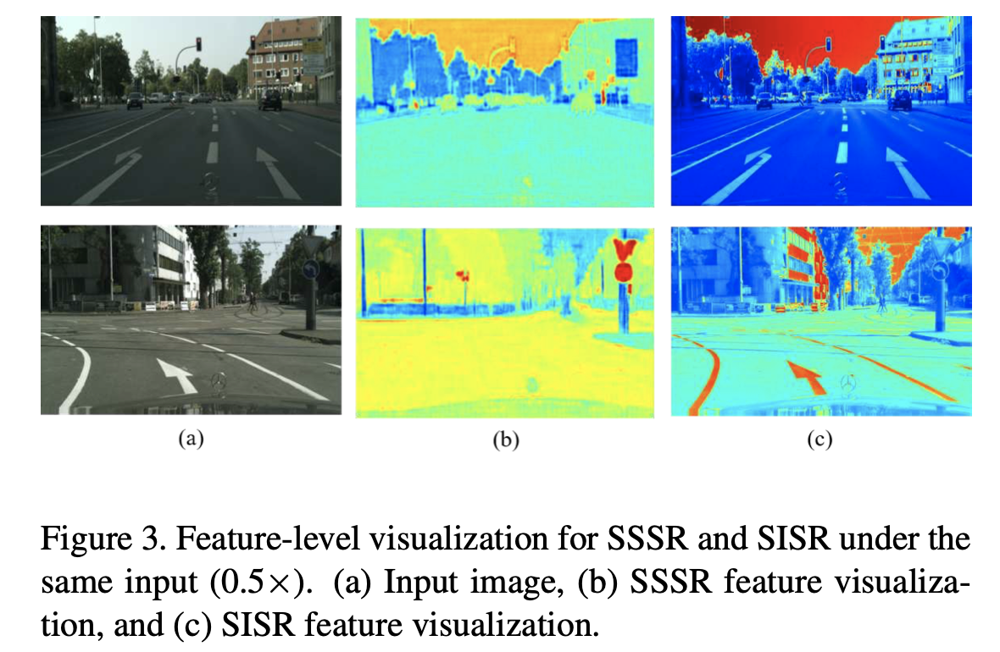
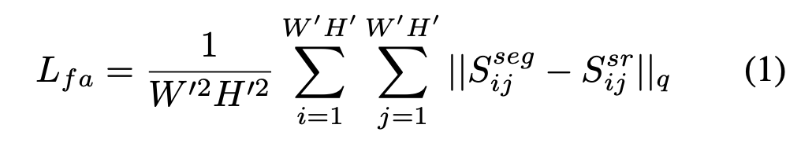
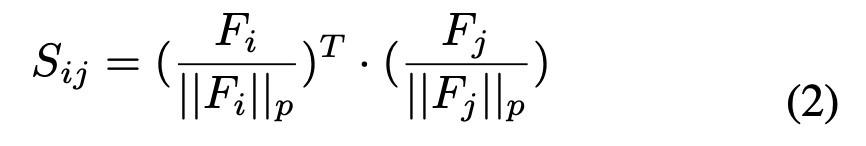
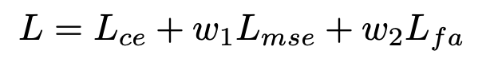
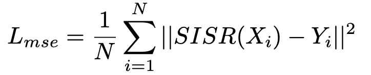
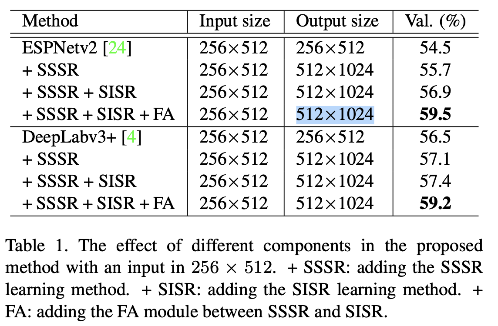
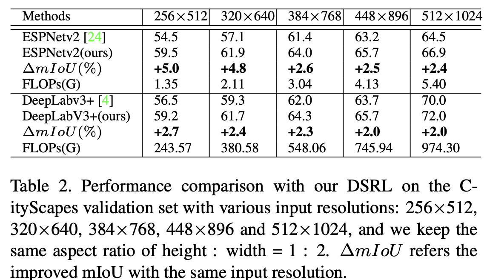

论文名称：《Dual Super-Resolution Learning for Semantic Segmentation》

论文链接：http://openaccess.thecvf.com/content_CVPR_2020/papers/Wang_Dual_Super-Resolution_Learning_for_Semantic_Segmentation_CVPR_2020_paper.pdf

代码链接：https://github.com/wanglixilinx/DSRL (等待开源)

- #### 本文主要贡献：

  1.本文提出了对偶超分辨率学习(DSRL)来保持高分辨率的表达。在保证推理速度的情况下提高分割的表现;

  2.在其他例如人体姿态估计等需要高分辨率表达的任务中验证了DSRL的泛化性。

  3.在计算代价几乎不变的情况下，在语义分割任务中带来了2个点以上的提升。

- #### 背景补充

  - 什么是SISR(Single Image Super-Resolution)?

  - SISR指的是将图片从低分辨率恢复到高分辨率的过程。目前有四种主流的有监督图像超分辨率方法：

    1.Pre-upsampling SR. 先通过双线性差值等上采样方法得到高分辨率图片，再经过深度网络来训练，缺点是计算代价比较大。
    2.Post-upsampling SR. 将可学习的上采样层至于网络的末端进行端到端的学习，相较上一种减小了计算量。
    3.Progressive-upsampling SR. 基于Post-upsampling SR，通过逐步恢复高分辨率图片来减小学习的难度。可以得到多尺度的高分辨率图片。
    4.Iterative up-and-down SR. 探索可迭代的上采样和下采样层得到中间图片，并将它们混合得到最终的高分辨率图片。

  

  - 本文使用的SISR方法基于第二种Post-upsampling SR

- #### 网络整体结构

  

- #### 对偶超分别率学习（DSRL）

  - 现已提出的语义分割网络中原始细节的恢复大都依赖于Decoder，本文提出的DSRL在不增加计算量和内存的前提下改善了分割的效果，特别是对于输入图像分辨率比较小的情况。DSRL包括三个部分：

    1.语义分割超分辨率(SSSR);
    2.单一图片超分辨率(SISR);
    3.特征亲和模块(FA);

  

  - **1.SSSR**

    对于语义分割，简单地在网络后面加上一个差值上采样模块来得到最终预测的mask.例如我们输入网络的图片分辨率是512x1024，网络最终输出的预测mask应该也是512x1024，最后可以再应用一个差值上采样模块即可得到1024x2048的mask.

    

  - **2.SISR**

    文章表明，仅仅使用decoder模块来恢复高分辨率语义分割表达是不够的，因为decoder要么是一个双线性差值操作，要么是一个简单的子网络，它无法带来更多的信息(输入是低分辨率i.e.512x1024).SISR的目标在于从低分辨率的输入得到高分辨率的图片。这意味着SISR可以从低分辨率的输入中重构图片细粒度的结构信息，这对与语义分割是很有帮助的。从如下SISR和SSSR两个分支的特征图的可视化看出，SISR的特征图包括更多复杂的物体结构。

    

  - **3.FA**

    因为SISR相比SSSR包括更复杂的结构信息，故需要使用特征亲和力特征学习高分辨率特征。亲和力损失如下所示：

    

    

    

  - 其中F表示W'xH'xC'的特征图，F_i表示第i个像素位置的长度C'的特征向量。S_ij表示特征图中第i个位置像素和第j个位置像素的相似度，S就是特征图两两像素的相似度矩阵。文中使用的q=1,p=2.

  - **优化损失**

    最终要优化的损失包括三部分：一个是用于监督语义分割的CE loss，一个是用于监督超分辨率重建的MSE loss，还有一个就是上面提到的FA loss。损失函数公式如下图所示：

    

    

  

  

- #### 实验结果

  

  

  

